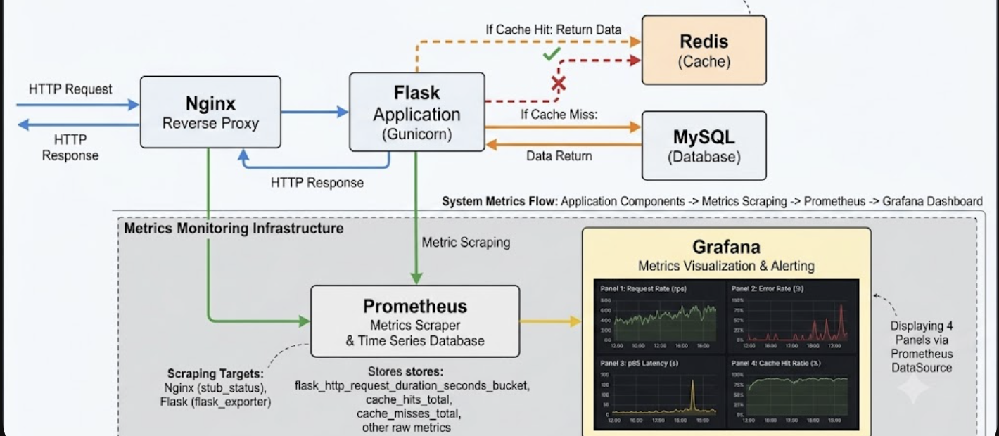

# This is a project to demonstrate reliability for a flask app

A production-grade Flask service built to demonstrate SRE principles - observability, resilience, chaos enginerring and automated deployment

# Architecture

# Observability
- Prometheus metrics: request rate, error rate, p95 latency, cache hit ratio
- Grafana dashboard with 4 panels
- Alerts configured for p95latency > 2s and cache hit ratio < 0.1

## Resilience Pattern
- Three-state circuit breaker (CLOSED/OPEN/HALF-OPEN)
- Redis connection timeout: 100ms
- Graceful degradation to MySQL on Redis failure
- Health endpoint with dependency states

## Chaos Engineering Results
|         Scenario    |     Before | After fix |
|-------------------------|--------|-----------|
| Redis failure detection | 8000ms | 124ms |
| p95 latency during failure | 10,000ms | 130ms |
| Cache hit ratio recovery | N/A | Auto-recovers via HALF-OPEN circuit |

## CI/CD pipeline
Push to main -> Build -> Test -> Push to GHCR -> Deploy to EC2 -> Health verified

## SLO targets
- Availability: 99.5% over 30-day window
- p95 latency: < 100ms normal, < 200ms degraded

## How to deploy

### Local deployment
1. Clone the repo
   \`\`\`bash
   git clone https://github.com/sanjaybhide1990/flask-with-mysql-redis.git
   cd flask-with-mysql-redis
   \`\`\`

2. Create a `.env` file in the project root:
   \`\`\`
   DB_USERNAME=root
   DB_PASSWORD=your_password
   DB_NAME=users
   \`\`\`

3. Start the stack:
   \`\`\`bash
   docker compose up -d
   \`\`\`

4. Verify it's running:
   \`\`\`bash
   curl http://localhost/health/ready
   \`\`\`
   Expected: `{"checks": {"database": "ok", "redis": "ok"}}`

5. View metrics and dashboards:
   - Prometheus: http://localhost:9090
   - Grafana: http://localhost:3000 (default login: admin/admin)

### Production Deployment(CI/CD)

This project deploys automatically to AWS EC2 on every push to `main`.

**Pipeline stages:**
1. Build Docker image
2. Run health check against live MySQL + Redis services
3. Health check the built container before proceeding
4. Push image to GitHub Container Registry (GHCR)
5. SSH into EC2 and pull the new image
6. Roll out via `docker compose up -d`
7. Verify deployment with health check (retries for up to 2 minutes)
8. Clean up old images

**Required GitHub Secrets:**
| Secret | Purpose |
|---|---|
| `EC2_HOST` | Public IP or Elastic IP of target server |
| `EC2_USERNAME` | SSH user (typically `ubuntu`) |
| `EC2_SSH_KEY` | Private key for SSH authentication |
| `EC2_APP_DIR` | Deployment directory on the server |

**Manual deployment** (if needed):
\`\`\`bash
ssh -i your-key.pem ubuntu@YOUR_EC2_IP
cd /home/ubuntu/flask-app
docker compose -f docker-compose-prod.yml pull
docker compose -f docker-compose-prod.yml up -d
\`\`\`

**Rollback procedure:**
\`\`\`bash
# Pull a previous image tag (using the git SHA)
export IMAGE_TAG=<previous-commit-sha>
docker compose -f docker-compose-prod.yml up -d
\`\`\`

## Known Limitations & Future Work

- Production deployment currently lacks centralized observability. 
  Prometheus/Grafana run locally for development and chaos testing 
  but are not yet deployed alongside the production EC2 instance.
- Next step: deploy a separate lightweight monitoring instance, or 
  migrate to a managed observability service (Grafana Cloud, 
  CloudWatch) to monitor the production deployment without 
  resource contention on the application server.
